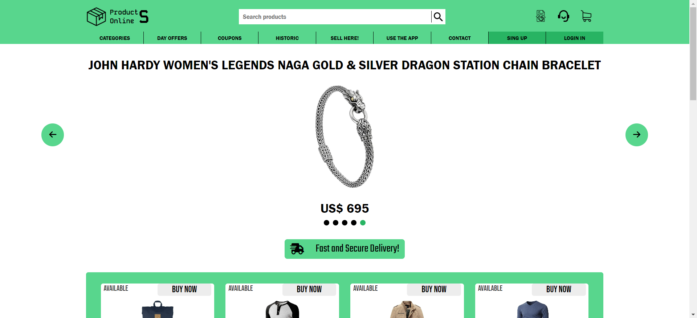

<h2 id="test"></h2>
- <h2>Deploy link:</h2>

```
https
```


<h1 align="center" style="color: #805ad5; font-weight: bold;">Product Online Store</h1>
<p align="center">
<a href="#tech">Technolgies</a> |
<a href="#how">How was made</a> |
<a href="#test">Objective</a>
</p>


<p align="center">
<b>This application is a pessoal project.</b>
</p>


<p align="center">
  <p>
    
  </p>
</p>


- <h2 id="tech">Technologies</h2>
HTML, CSS and JavaScript.

<!--### Client:

### Server:-->

### API:
...


- <h2 id="how">How was made</h2>
...


- <h2 id="obj">Objective</h2>
...
